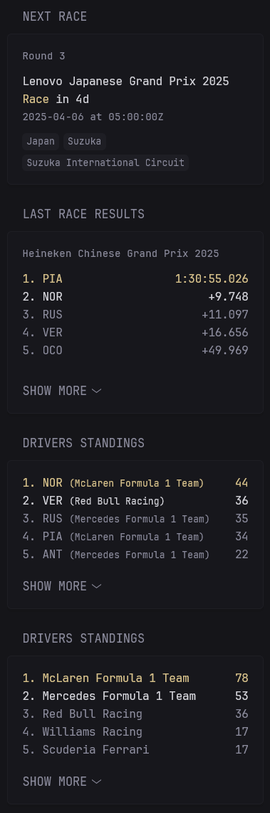

<div align="center">
  
# The F1 Season... At A Glance
  
## Table of Contents:

[Background](#background)
<br>
[Why Use This RepO?](#why-use-this-repo)
<br>
[Solution](#solution)
<br>
[Installation](#installation)
<br>
[Demo](#demo)
<br>
</div>

# Background
I host [glance](https://github.com/glanceapp/glance) on one of my home servers. As a big F1 fan, I was excited to see that the community had added a [F1 integration](https://github.com/glanceapp/community-widgets/blob/main/widgets/formula1-widgets-by-abaza738/README.md), but was disappointed with the rigidity of the API it uses. 

# Why Use this Repo?
I ran into the following issues with the API that this repository solves:
1. Times were shown in UTC, not specific to a users timezone.
2. API calls were slow and there was no smart caching, slowing down my Glance.
3. Lack of control over data fields like team name. It shows lengthy official team names like "Mercedes AMG Petronas F1 Team" instead of just "Mercedes"
4. Lacking detail. For instance, I wanted a track map, lap record holder, previous winners when it displayed the next race.
5. Lack of dynamic control over event time. While you can select what event to have a countdown to (IE race vs. qualifying), you have to manually specify this instead of using time analysis to show the next event that hasn't passed.

# Solution
## APIs
As a solution, I created 4 API endpoints that allow me full control over what I fetch, as well as caching behaviour. Across each endpoint, I utilize smart caching that only refreshes the underlying API data a few hours after the race is over, preventing unnecessary loading when results have not changed.

The 4 end points are:
1. Next race. This features details such as circuit name, lap record holder, and countdown to the race.
2. Driver championship. This cleans up the naming of each driver and adds a nice nationality flag for each driver.
3. Constructors championship. Cleans up team names to a simplified form and adds home country flag for each team.
4. Track map. This generates an SVG of the current track. It relies on positioning data from a prior years event at the same track.

## Widgets
I really enjoyed the theme and style of the community widgets by @abaza738, so I largely use their theming and design, I just change the underlying API to achieve more custom results.

# Installation
This repo uses docker compose to install. Verify that you are up to date. Below is an example compose file.
```yaml
version: "3.9"

services:
  f1_api:
    container_name: f1_api
    image: skyallinott/f1_api:latest
    environment:
      - TIMEZONE=America/Edmonton # Specify your timezone.
      - TRACK_COLOUR=#e5d486 # Specify desired track map color
      - EVENT_DETAIL=main # Optional. main tracks qualis and races (inc. sprints), race tracks races. 
    ports:
      - 4463:4463
    restart: unless-stopped
```

To integrate with your glance set up (to install glance, see their documentation), add the [f1_next_race.yml](f1_next_race.yml), [f1_drivers_championship.yml](f1_drivers_championship.yml), and [f1_constructors_championship.yml](f1_constructors_championship.yml) to your glance config, making sure to replace the {LOCAL_IP} with your devices IP, as well as updating the ports if needed. 


# Demo
My current F1 Glance set up is shown below on the left, versus the community widget on the right.

<div float="left" >
  
  
</div>
